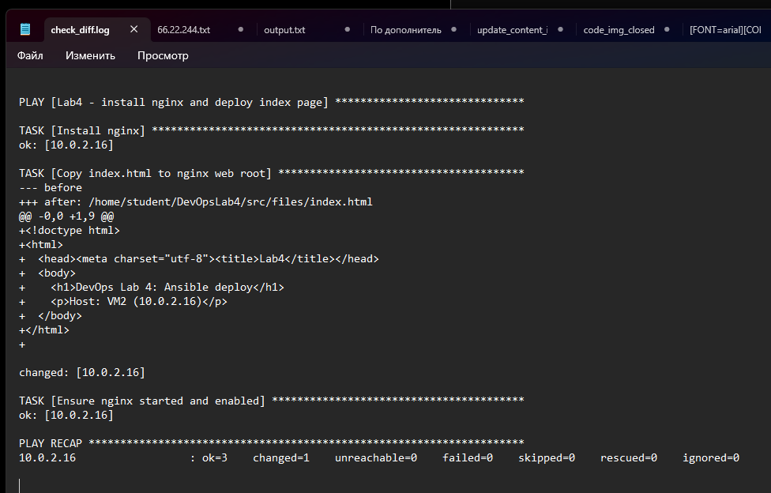
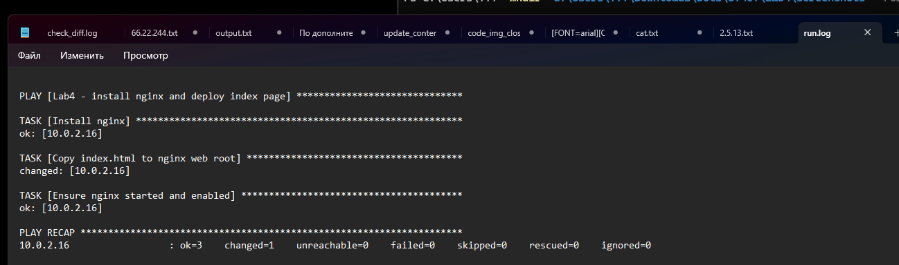
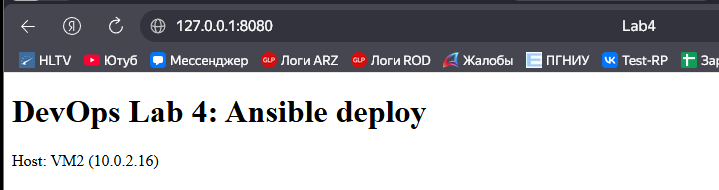

# DevOps Lab 4 — Ansible basics (nginx + index.html)

**Демидов Матвей Александрович, ФИТ-1-2024 НМ**  
**Дисциплина:** Методы и инструменты DevOps  
**Лабораторная работа:** ЛР по лекции 4 (Ansible basics)

---

## 1) Цель работы
Развернуть **nginx** на целевой VM с помощью **Ansible** и задеплоить страницу `index.html`.

---

## 2) Стенд

| Узел | Роль | IP | SSH из Windows |
|---|---|---:|---|
| VM1 | Control Node (Ansible) | `10.0.2.15` | `ssh student@127.0.0.1 -p 2222` |
| VM2 | Managed Node (Nginx)  | `10.0.2.16` | `ssh student@127.0.0.1 -p 2223` |

**Сеть:** NAT Network `10.0.2.0/24`  
**Проверка в браузере Windows:** `http://127.0.0.1:8080` (проброс `8080 -> VM2:80`)

---

## 3) Структура репозитория
- `src/` — playbook и конфиги Ansible
- `src/files/index.html` — страница для nginx
- `screenshots/` — скриншоты выполнения
- `check_diff.log` — лог запуска `--check --diff`
- `run.log` — лог реального запуска
- `curl_vm2.log` — лог проверки `curl`

---

## 4) Ключевые команды (что выполняли)

### Подключение по SSH (Windows Terminal)
```bash
# VM1
ssh student@127.0.0.1 -p 2222

# VM2
ssh student@127.0.0.1 -p 2223
```

### Установка Ansible (на VM1)
```bash
sudo apt update
sudo apt install -y ansible
ansible --version
```

### Запуск плейбука (на VM1)
```bash
cd ~/DevOpsLab4/src

# проверка (без внесения изменений)
ansible-playbook playbook.yml --check --diff

# реальный запуск
ansible-playbook playbook.yml
```

### Проверка результата
```bash
# проверка с VM1
curl http://10.0.2.16
```

---

## 5) Файлы Ansible

### Inventory
Файл: `src/inventory.ini`
```ini
[web]
10.0.2.16
```

### Playbook
Файл: `src/playbook.yml`
```yaml
- name: Lab4 - install nginx and deploy index page
  hosts: web
  remote_user: runner
  become: true
  gather_facts: false

  tasks:
    - name: Install nginx
      ansible.builtin.apt:
        name: nginx
        state: present
        update_cache: yes

    - name: Copy index.html to nginx web root
      ansible.builtin.copy:
        src: files/index.html
        dest: /var/www/html/index.html
        owner: www-data
        group: www-data
        mode: "0644"

    - name: Start and enable nginx (systemd)
      ansible.builtin.systemd:
        name: nginx
        state: started
        enabled: true
```

---

## 6) Скриншоты

> Если изображения не отображаются, проверь, что файлы лежат в `screenshots/` и называются:
> `01_check_diff.png`, `02_playbook_run.png`, `03_browser_result.png`

### 6.1 Проверка плейбука (`--check --diff`)


### 6.2 Успешный запуск плейбука


### 6.3 Результат в браузере (Windows)


---

## 7) Логи
- `check_diff.log` — вывод `ansible-playbook --check --diff`
- `run.log` — вывод реального запуска плейбука
- `curl_vm2.log` — вывод проверки `curl -v http://10.0.2.16`